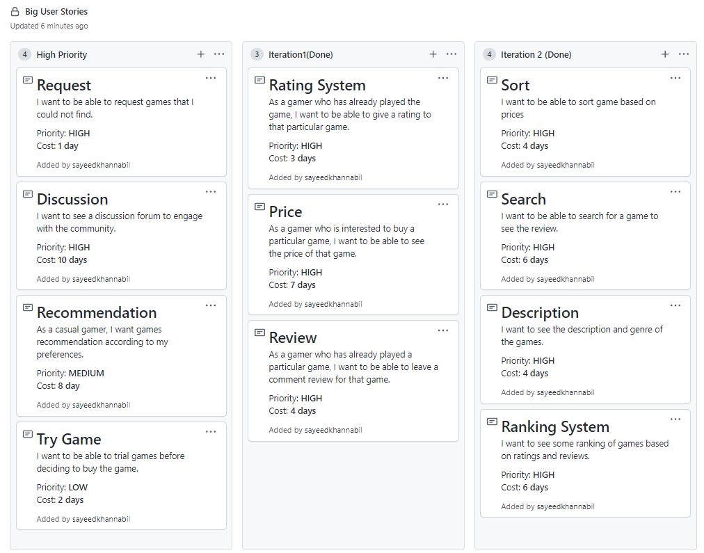
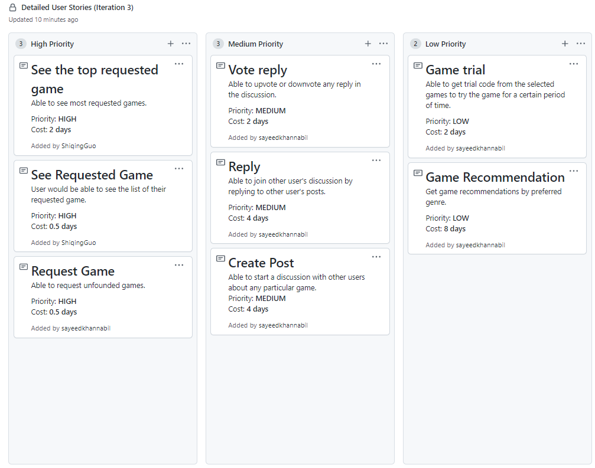
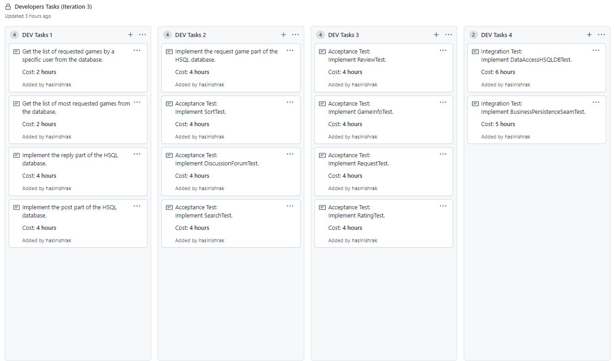

# Game Rating System

The `Game Rating System` is an app where people can see and give review of games and find information about them.

## Team Members

* Shiqing Guo
* Hasin Ishrak
* Abu Sayeed Khan
* Katharine Kowalchuk
* Gongyu Liao

## Packages and Major Source Codes

The main package in the project is `comp3350.grs`.  There are 5 other packages in `comp3350.grs`. Since the project followed three layer architecture; we have `presentation`, `persistence` and `business`  packages. We also have two more packages: `application`  and `objects`.

### Application:

The `application`  package is for running the whole program. There are two classes in there.

##### Services:

`Services`  class is made to create to initiate the stub-database we have in the project.

##### Main:

`Main`  class is the driver class of the project. Using `Main`  we start and close the program.

#### Major Changes:

There are no major changes on this part in Iteration 2.

### Business:

The classes in `Business` package handle the logic of the program. There are 8 classes in this package.

##### AccessGames:

`AccessGames` class handles the logic behind `game` object storage in the HSQL database and used to access and modify games in the database.

##### AccessUsers:

`AccessUsers` class handles the logic behind `user` object storage in the HSQL database and used to access and modify user information in the database.

##### AccessRatings:

`AccessRating` class handles the the logic behind `rating` object storage in HSQL database and used to access and modify ratings of games in the database.

##### AccessReviews:

`AccessReviews` class handles the logic behind `review` object storage in HSQL database and used to access and modify reviews of games in the database.

##### AccessPosts:

`AccessPosts` class handles the logic behind accessing and modifying `Post` object in both HSQL database and stub-database.

##### AccessReplys:

`AccessReplys` class handles the logic behind accessing and modifying `Reply` object in both HSQL database and stub-database.

##### AccessRequests:

`AccessRequests` class handles the logic behind accessing and modifying `Request` object in both HSQL database and stub-database.

##### AccessVoteReplys:

`AccessVoteReplys` class handles the logic behind accessing and modifying `Upvote` and `Downvote` objects in both HSQL database and stub-database.

#### Major Changes:

* Database access for new feature classes: `AccessPost` , `AccessReplys`, `AccessRequests` and `AccessVoteReplys`

### Objects:

The `objects` package have the necessary object class that the project needed. There are 12 classes, 2 abstract classes and 1 interface in this package.

##### User:

User's functionality is defined the `User` class. Each user is identified using an unique user id. This is an abstract class for `RegisteredUser` and `Guest` class.

##### RegisteredUser:

This is the child class of `User` abstract class. Users can registered themselves using an unique user id and login later with the id and the password given by the user.  This class handles the login and registration part of an user.

##### Guest:

This is also a child class of `User` . If users do not want to registered themselves for using the game, they can select guest and still be able to use the app without registration. But in that case, all of the user's activity will be saved as guest and the user would not be able track their given ratings and review.

##### Rating:

An user can give a rating between (exclusive)0-5(inclusive) for a game. `Rating` class handles the logic behind that rating.

##### Review:

An user can leave a review of a game. `Review` class handles how those reviews get processed.

##### Game:

`Game` class handles the overall functionality of the game. In the class, game info, price and feedbacks are stored.

##### ForumContent:

`ForumContent` class is a parent class of `Post` and `Reply` which are content of the discussion forum.

##### Post:

An user can create posts in the discussion forum. This class handles the functionality of creating posts in the forum.

##### Reply:

An user can give replies to previously created posts. The class handles the functionality of creating replies in the forum. Using reply multiple users can engage in a discussion in the discussion forum.

##### Request:

An user can requests for a game to be added in the app if they cannot find the information of a game they are looking for. They can see the games they requested and also what are the most requested games other users want. With `Request` class, these need can be handled.

##### VoteI:

This is a interface for `Vote` class

##### Vote:

`Vote` is a abstract class which is the parent class of `Upvote` and `Downvote`. If a user like a post or reply they can upvote it and if they dislike something they can downvote it.

##### Upvote:

`Upvote` is a child class of vote. It handles the functionality to upvoting a post or a reply.

##### Downvote:

`Downvote` is a child class of vote. It handles the functionality to downvoting a post or a reply.

##### VoteReply:

`VoteReply` is a combination of `Vote` and `Reply`. With this class we can include the functionality of voting in the `Reply` class.

#### Major Changes:

* Created object classes to implmenent `Vote` , `Reply`, `Post` and `Request` functionalities.

### Persistence:

The `persistence` package hold the storage class of the program. There is only one class, one abstract class and one interface in this package.Besides, `DataAccessStub` is in the test part of the `persistence` package.

##### DataAccess:

`DataAccess` is an abstract class which is used to hold the default values for the HSQL database. `DataAccess` is used by the class `DataAccessObject`and `DataAccessStub`to load default data.

##### DataAccessI:

`DataAccessI` is an interface which is used to define the methods that must be implemented on `DataAccessObject`and `DataAccessStub`.

##### DataAccessObject:

This is the class that handles the HSQL database and the functionality for the database.

#### Major Changes:

* added more methods to the interface and updated the DataAccessObject to store data for the new features.

* created database for `Post`, `Reply`, `Request` and `Vote`

### Presentation:

The `presentation` package is responsible for all of the classes that handles the UI(user interface).  There are 14 classes in this package.

##### GameGallery:

`GameGallery` is the UI for the gallery where all of the stored games is shown.

##### GamePage:

`GamePage` is the UI for individual games where the game info, price and feedback are shown.

##### Login:

`Login` is the UI for login page.

##### LoginBackground:

`LoginBackground` is the fragment shows that the background and buttons when an user start the app.

##### MainActivity:

`MainActivity` shows the homepage of the app.

##### Signup:

`Signup` is the UI for sign up page.

##### UseridAndPass:

`UseridAndPass` is the fragment for buttons and boxes for userid and password in login and signup.

##### TopBar:

`TopBar` is the fragment for the bar in the top of the application that shows in which part of the app we are currently in.

##### UserPage:

`UserPage` is the UI for user account page for both registered and guest users.

##### Utilites:

`Utilities` is used to implement a bunch of useful features like alert messages, button shrinking when a button is touched by the user, etc.

##### ForumPage:

`ForumPage` is used to implement the main page of forum page where the users able to create a post.

##### GalleryOrForum:

`GalleryOrForum` is used to implement the page where user can select if they want to go to the gallery page or the forum page.

##### PostPage:

`PostPage` is used to implement the page view of posts.

##### RequestPage:

`RequestPage` is used to implement the main page of game request.

### Major Changes:

* Added selection page for gallery and forum
* Created forum page for discussion forum feature
* Created page to view the recent posts and replies
* Created UI page for request game feature

## Testing:

We have done `Unit testing` , `Integration testing` and `Acceptence testing` in our project.

#### Unit Test:

We have done `unit test` for all of the classes `business`, `objects` and `persistence` layers. 

###### Test Classes:

* `business`:
  * AccessGamesTest
  * AccessPostsTest
  * AccessRatingsTest
  * AccessReplysTest
  * AccessRequestsTest
  * AccessReviewsTest
  * AccessUsersTest
  * AccessVoteReplysTest
* `objects`:
  * DownvoteTest
  * GameTest
  * GuestTest
  * PostTest
  * RatingTest
  * RegisteredUserTest
  * ReplyTest
  * RequestTest
  * ReviewTestUpvoteTest
  * VoteReplyTest
* `persistence`:
  * DataAccessITest
  * DataAccessStub

#### Integration Test:

`Integration testing` is used for `BusinessPersistenceSeamTest` and `DataAccessHSQLDBTest` to test the relationship between respective classes.

###### Test Classes:

* BusinessPersistenceSeamTest
* DataAccessHSQLDBTest

#### Acceptance Test:

For testing all of the big user stories implemented in the project, we have used the `Acceptance Test`. 

###### Test Classes:

* DiscussionForumTest
* GameInfoTest
* RatingTest
* RequestTest
* ReviewTest
* SearchTest
* SortTest

## Log:

The log is kept in `log.txt` file in the main page of the repository.

We have kept the log of the meetings and individual work in the log file. The format of the individual work is (date, name, task, expected time, actual time).

## Big User Stories:

## Detailed User Stories:

## Developer Task:

## Major Implemented Features:

### Iteration 3:

The major implemented features in this iteration:

1. Discussion Forum
2. Game Request

* `Discussion Forum` is a forum page where users will be able to create post to start a discussion and other users will be able to reply in the post.
* `Game request` is a feature by which users will be able to request for games that are not in the app. Users will also able to see their requested games and what are the most requested games in the app.

### Iteration 2:

The major implemented features in this apps are:

1. Searching Games
2. Sorting Games
3. Genre
4. More User information

* `Searching Games	` is easier with the newly updated iterative search which identify the game while typing the game name to give faster search result and more relevant game result to the users.
* `Sorting Games` can be done in multiple categories. User can sort the games according to the price, name, number of rating a game has or number of reviews in games. All the sorting can be done both in ascending and descending order which gives the users more flexibility to sort the games according to their need.
* `Genre` is added to the game description so that user can quickly figure out the type of the game. example: `action`, `rpg`, `shooting` etc.
* `More user information` is added to the app. There is now a dedicated page for a user to view all of their user information.

### Iteration 1:

The major implemented features in this apps are:

1. Game library
2. Game Info page
3. Game Feedback

* `Game library` is the library of all of the game we have on our app. After login as a guest or user or signing up, the first page in the GUI is the `Game library`.
* `Game info page` is the information page for each individual game in the game library. From `Game library`, for selecting any particular game, users will be able to go to the `Game info page` of the selected games.
* `Game Feedback` is the rating and review system of the app and the most important one. On the `Game Info page` user will be able to see the given feedbacks of other users and leave there own feedback. In each `Game info page` there is a separate section for feedbacks.

We have also implemented login and sign up option for the users that can be accessed from the homepage. And if the user do not want to create an account, they can select `continue as guest` to use the app without creating an account. The userid should not contain space and should not be"Guest", as "Guest" is reserved for guest users. The password should not contain space. If the userid or password does not satisfy the format, you won't be able to signup. If the user_id and password does not match, you won't be able to login. 
You must rate the game, before you write a review.

## Issues

* Because of the time constraint, we did not implement `Game Recommendation` feature and `Try Game` feature.
* We did not used script for the database. if the marker need to restore the database to original state, just delete it and reinstall.

## Project Demo

#### Login:

#### User Page:

#### Search:

#### Sort:

#### Game Request:

#### Post:

#### Reply:

#### Vote:

## System Requirement:

#### Android Version: 

* Minimum requirement: Android 6.0 (Marshmallow). 

* API level: 30

#### Tested Device:

* Emulator: 
  * Nexus 7, API 23, CPU x86, Android 6.0
  * Pixel_3a, API 30, CPU x86, Android 11.0
* Hardware:
  * Pixel_4a, API 30, CPU x86, Android 11.0

#### Testing:

For testing the code  `Junit 4` is used.

## Project URL:

https://github.com/sayeedkhannabil/Software-Engineering-1

## Readme Link:

https://sayeedkhannabil.github.io/Software-Engineering-1/
